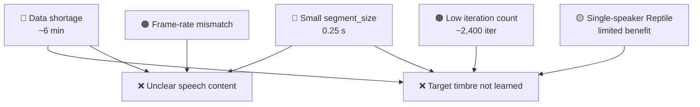

# RVC + Reptile Meta-Learning Voice Conversion — Quality Analysis

## Current Results Summary

| Metric | Status | Issue? |
|--------|--------|--------|
| Output Length | Matches input (~3 s) | Resolved |
| Speech Content Preservation | Phonetic content is unclear | **Problem** |
| Target Speaker Similarity | Does not resemble the target speaker | **Problem** |

---

## Root Cause Analysis

### 1. Extremely Small Training Segment Size

```python
# step4_model.py (line 34)
segment_size = 12000 // 480   # = 25 frames ≈ 0.25 s

# step4_dataset.py (line 24)
SEGMENT_SIZE = 12000           # 0.25 s at 48 kHz
```

> A `segment_size` of **12,000 samples (0.25 s)** defines how much audio the Generator sees in a single forward pass.
> At roughly one syllable of speech, the model cannot learn the temporal context required for natural-sounding synthesis (phoneme transitions, prosody, utterance-level patterns).

**Comparison with standard RVC / VITS configurations:**

| Configuration | `segment_size` | Duration |
|---------------|---------------|----------|
| **Current** | 12,000 | **0.25 s** |
| RVC default (48 kHz) | 17,280 | 0.36 s |
| VITS recommended | 32,768 | 0.68 s |

**Impact:** Insufficient temporal context prevents the model from learning phoneme transitions, prosody, and natural speech flow.

---

### 2. Insufficient Training Data Volume

```
100 WAV files × ~3.5 s each = ~350 s ≈ 5.8 min
```

> Approximately **6 minutes** of training data is well below the minimum recommended for RVC:
> - **Minimum:** ~10 minutes
> - **Ideal:** 30 min – 1 hour
> - **High quality:** 2 – 5 hours

**Impact:**
- The Generator cannot adequately learn the target speaker's timbral characteristics.
- The Faiss index contains too few vectors, degrading retrieval quality.
- The model lacks exposure to the full range of phonemes and intonation patterns needed for generalization.

---

### 3. Insufficient Fine-Tuning Iterations

```python
# step4_finetune.py
FT_EPOCHS     = 200
FT_BATCH_SIZE = 8
```

**Effective iteration count:**
```
100 chunks / batch_size 8 = ~12 batches per epoch
200 epochs × 12 batches   = ~2,400 iterations
```

> Standard RVC training typically requires **10,000 – 100,000+ iterations** for convergence.
> The current ~2,400 iterations are far from sufficient.

---

### 4. HuBERT Frame-Rate Mismatch During Inference

The previous fix resolved the output-length issue, but interpolation introduces its own limitations:

```
HuBERT: 50 fps (20 ms/frame) → interpolation → 100 fps
```

During training, HuBERT features and F0 are aligned at the same `hop_length=480` rate.
During inference, features are extracted at a different frame rate and interpolated, which can cause subtle temporal misalignment artifacts.

---

### 5. Structural Limitations of Reptile with a Single Speaker

```python
# step4_reptile.py
NUM_META_STEPS   = 80
INNER_STEPS      = 8
NUM_TASK_SAMPLES = 20   # 20-sample subsets drawn from 100 total
```

> Reptile is designed for **multi-speaker** scenarios where each task represents a different speaker.
> When all tasks are drawn from a single speaker, the algorithm effectively reduces to **regularized fine-tuning**.
>
> With only 100 samples, 20-sample subsets overlap heavily, further diminishing any meta-learning benefit.

---

## Impact Diagram



---

## Recommended Improvements

### Option 1: Optimize Training Configuration (Code-Only — Highest Impact)

| Parameter | Current | Recommended | File |
|-----------|---------|-------------|------|
| `SEGMENT_SIZE` | 12,000 (0.25 s) | **32,768 (0.68 s)** | step4_dataset.py |
| `segment_size` (model) | 12000 // 480 = 25 | **32768 // 480 = 68** | step4_model.py, step5_inference.py |
| `FT_EPOCHS` | 200 | **800 – 1,000** | step4_finetune.py |
| `FT_BATCH_SIZE` | 8 | **4** (adjust for VRAM) | step4_finetune.py |
| `CHUNK_SEC` | 3.5 s | **8 – 10 s** | step2_preprocess.py |

### Option 2: Increase Training Data Volume

- Collect additional recordings of the target speaker (**≥ 30 minutes** recommended).
- Apply data augmentation: pitch shifting, speed perturbation, noise injection.

### Option 3: Improve the Inference Pipeline

- **Sliding-window inference:** Split long utterances into overlapping segments → convert each → cross-fade stitch.
- **Consistent HuBERT extraction:** Ensure the same extraction method and frame rate are used for both training and inference.

### Option 4: Replace Reptile with Direct Fine-Tuning

- With only 100 samples from a single speaker, Reptile provides minimal benefit over standard fine-tuning.
- Fine-tuning directly from the pretrained weights may yield comparable or better results.
- The Reptile outer update can pull weights back toward the initialization, potentially slowing convergence.
