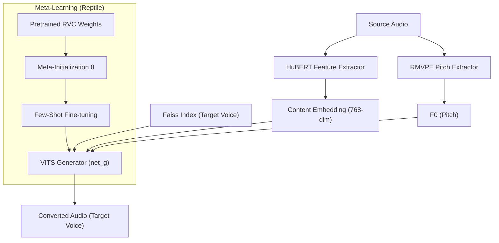

# RVC + Reptile Meta-Learning Voice Conversion

A voice conversion system that combines [RVC v2](https://github.com/RVC-Project/Retrieval-based-Voice-Conversion-WebUI) with [Reptile meta-learning](https://arxiv.org/abs/1803.02999) for rapid target speaker adaptation. The entire pipeline runs on a single Google Colab notebook.

Given a small set of target speaker recordings, the model learns an optimized initialization via Reptile and fine-tunes to produce high-fidelity voice conversions from arbitrary source audio.

## Architecture



### Core Components

| Component | Role | Technology |
|-----------|------|------------|
| **Content Encoder** | Speaker-agnostic speech feature extraction | HuBERT / ContentVec (frozen) |
| **Pitch Extractor** | Fundamental frequency (F0) extraction | RMVPE |
| **VITS Generator** | Waveform synthesis | Conditional VAE + Flow + HiFi-GAN |
| **Retrieval Module** | Target speaker trait retrieval | Faiss IVF index |
| **Meta-Learner** | Rapid speaker adaptation | Reptile (first-order) |

## Pipeline


The notebook is organized into **18 cells** across 5 logical steps:

### Step 1 — Environment Setup (Cells 1–5)

| Cell | Script | Purpose |
|------|--------|---------|
| 1 | `step1_setup.py` | Verify GPU runtime |
| 2 | `step1_install.py` | Install pip packages & ffmpeg |
| 3 | `step1_drive.py` | Mount Google Drive & create directories |
| 4 | `step1_download.py` | Download pretrained models |
| 5 | `step1_rvc_clone.py` | Clone RVC repo & verify imports |

### Step 2 — Data Preprocessing (Cells 6–7)

| Cell | Script | Purpose |
|------|--------|---------|
| 6 | `step2_preprocess.py` | Resample to 48 kHz, remove silence, split into 3.5 s chunks |
| 7 | `step2_visualize.py` | Waveform & mel-spectrogram visualization |

### Step 3 — Feature Extraction (Cells 8–10)

| Cell | Script | Purpose |
|------|--------|---------|
| 8 | `step3_hubert.py` | Extract HuBERT 768-dim content embeddings |
| 9 | `step3_f0.py` | Extract F0 pitch via RMVPE |
| 10 | `step3_verify.py` | Validate extracted features & visualize |

### Step 4 — Model & Reptile Meta-Learning (Cells 11–14)

| Cell | Script | Purpose |
|------|--------|---------|
| 11 | `step4_dataset.py` | Define `RVCDataset` class |
| 12 | `step4_model.py` | Load Generator / Discriminator & define losses |
| 13 | `step4_reptile.py` | **Reptile meta-learning training** |
| 14 | `step4_finetune.py` | Fine-tuning from meta-learned initialization |

### Step 5 — Inference (Cells 15–18)

| Cell | Script | Purpose |
|------|--------|---------|
| 15 | `step5_index.py` | Build Faiss IVF index |
| 16 | `step5_inference.py` | `VoiceConverter` class & initialization |
| 17 | `step5_convert.py` | Single-file conversion & comparison visualization |
| 18 | `step5_batch.py` | Batch conversion & ZIP download |

## How Reptile Works Here

```python
for meta_step in range(num_meta_steps):
    phi = copy(model.parameters())           # snapshot

    for step in range(inner_steps):          # inner loop
        loss = compute_loss(model, batch)
        optimizer.step()

    W = model.parameters()                   # adapted weights
    for p, w in zip(phi, W):
        p.data += meta_lr * (w.data - p.data)  # outer loop update

    load_parameters(model, phi)              # apply meta-update
```

The Reptile outer loop nudges the model's initialization toward a point that is easy to fine-tune for the target speaker, enabling faster convergence and better quality with limited data.

## Directory Structure

```
Google Drive/
└── RVC_MetaLearning/
    ├── dataset/
    │   └── target_voice/          # Target speaker WAV files
    ├── pretrained/
    │   ├── hubert_base.pt         # HuBERT
    │   ├── rmvpe.pt               # RMVPE
    │   ├── f0G48k.pth             # RVC Generator weights
    │   └── f0D48k.pth             # RVC Discriminator weights
    ├── features/
    │   ├── hubert/                # Extracted content embeddings
    │   ├── f0/                    # Extracted pitch features
    │   └── wav/                   # Preprocessed audio
    ├── checkpoints/
    │   ├── meta_G_*.pth           # Meta-learning checkpoints
    │   └── meta_D_*.pth
    ├── models/
    │   ├── target_voice.pth       # Final model
    │   └── target_voice.index     # Faiss index
    └── output/                    # Conversion results
```

## Key Hyperparameters

| Parameter | Value | Description |
|-----------|-------|-------------|
| Reptile meta-steps | 80 | Meta-learning iterations |
| Inner steps | 8 | SGD steps per inner loop |
| Meta LR (β) | 0.3 → 0 | Linearly decayed |
| Fine-tune epochs | 200 | CosineAnnealing schedule |
| Index ratio | 0.75 | Faiss retrieval blending weight |

## Requirements

- Python 3.10+
- PyTorch ≥ 2.0
- CUDA-enabled GPU (tested on Colab T4 / A100)
- `fairseq`, `faiss-gpu`, `librosa`, `scipy`, `soundfile`, `praat-parselmouth`
